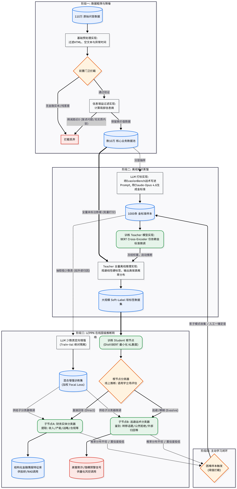

# 📈 A股互动易问答质量评估与逃避战术智能识别系统
> **基于 LCPPN 架构与半监督知识蒸馏的工业级金融 NLP 情报提炼管线**


## 🌟 项目简介

在高度复杂的 A 股金融市场中，上市公司管理层在互动易等平台的官方问答是极具价值的量化情绪信号。然而，真实的金融文本充斥着海量的“客套废话”（汉堡包结构），且高管在面对尖锐问题时，常采用“战略性模糊”、“外部归因”等语用学逃避战术。

本项目旨在从零构建一套端到端的高精度文本情报提炼引擎，彻底摒弃了传统的扁平化分类与浅层规则，创新性引入了以下工业级架构：

* **前置实体防线 (Entity Guardrail)**：基于 `FlashText` 的金融实体极速双向拦截，彻底根除闲聊噪音与“闭世界假设”漏洞。
* **半监督知识蒸馏 (Knowledge Distillation)**：利用 LLM (Claude-Opus) 构建零样本 CoT 金标准，训练 1.1 亿参数的 Teacher 模型输出海量“软标签（Soft Labels）”。最终蒸馏出速度翻倍、且 Macro-F1 强势突破 **0.767** 的轻量级 Student 模型 (DistilBERT)。
* **LCPPN 层级路由架构**：(Local Classifier Per Parent Node) 动态路由分类树，将极其复杂的意图识别解耦为 Root 宏观路由与多个 Sub-node 领域专家分类器。
* **Train-Val 绝对隔离的数据增强**：针对极少数类样本（如“外部归因”），运用 LLM 进行场景泛化，在绝对不污染验证集真实分布的前提下，抹平极端长尾效应。



## 🏗️ 核心架构 (LCPPN)

系统采用层级递进的漏斗式架构，精准剥离逃避战术并提炼财务信号：

1. **Level 0 (网关门卫)**: `FlashText` 金融实体探测 + 局部信息熵过滤，拦截低质废话。
2. **Level 1 (根节点分类)**: 判定董秘回答的语用学立场，分流至 `Direct (直接)`、`Intermediate (避重就轻)`、`Evasive (打太极)`。
3. **Level 2 (子节点专家)**:
   - **财务质量分支 (Direct 路由)**: 5 分类业务归因（资本运作、产能规划、技术研发、风险披露、财务指引）。
   - **逃避战术分支 (Evasive 路由)**: 4 分类心理归因（转移话题、战略性模糊、外部归因、推迟回答）。

## 📂 目录结构

```text
├── app/                        # 线上推理服务与前端界面
│   ├── main.py                 # FastAPI 后端：VRAM多路复用与 LCPPN 路由接口
│   └── index.html              # 瀑布流雷达诊断 Web UI
├── data/                       # 数据集与金融字典 
│   ├── others/                 # THUOCL、baostock 等金融专属实体字典与停用词表
│   └── processed/              # 清洗与 LLM 标注后的高质量流转数据 (需运行脚本生成)
├── models/                     # 模型权重目录
├── notebooks/                  # 数据分析与实验记录
│   ├── 00_Rejected_Cases_Analysis.ipynb
│   ├── 01_Model_Evaluation.ipynb    # [WIP] 学生模型性能与混淆矩阵评估
│   └── 02_Bad_Case_Analysis.ipynb   # [WIP] 错题本与主动学习 (Active Learning) 闭环分析
├── src/                        # 核心 NLP 训练管线 (Pipeline)
│   ├── 00_Data_Preprocess.py     # 基础数据清洗与对齐
│   ├── 01_Entities_Filter.py     # FlashText 极速实体白名单/黑名单双重过滤
│   ├── 02_Entropy_Calculated.py  # 信息增益与 Jaccard 相似度降噪
│   ├── 03_LLM_Labeling.py        # 零样本 CoT 高质量金标准构建
│   ├── 04~05_Teacher_*.py        # Teacher (Cross-Encoder) 训练与离线打标
│   ├── 06_Student_Model_Distillation.py # Student (DistilBERT) 软标签蒸馏
│   ├── 07~08_LCPPN_Subnodes_*.py # LCPPN 子节点数据分流与 Focal Loss 加权微调
│   └── 09_Inference_Pineline.py  # 离线端到端联调测试脚手架
├── utils/                      # 工具集
│   ├── data_expand.py          # LLM 少数类定向增强 (Train-Val 隔离)
│   ├── evaluate_student.py     # 模型性能评估脚手架
│   └── sampling.py             # 分层抽样工具
└── requirements.txt            # 项目依赖清单
```

## 🚀 快速启动

### 1. 环境安装
```bash
conda create -n qa_env python=3.10
conda activate qa_env
pip install -r requirements.txt
```

### 2. 模型训练与权重准备
由于模型权重（.bin / .safetensors）体积较大，未包含在 Git 仓库中。你需要按顺序运行 `src/` 目录下的 `00` 到 `08` 脚本，重新完成数据预处理、知识蒸馏与子节点微调。生成的模型会自动保存在 `models/` 目录下。

### 3. 启动在线诊断雷达 (Web UI)
进入 `app/` 目录，启动包含多路模型驻留的 FastAPI 引擎：
```bash
cd app
uvicorn main:app --port 8080 --reload
```
等待终端显示 `✅ 三个模型已就绪！` 后，直接在浏览器中双击打开 `app/index.html` 即可体验具备高并发能力与前置防线的 A 股话术实时诊断系统。

## 🗺️ Roadmap (开发计划)

- [x] 构建百万级金融 QA 数据清洗与降噪实体滤网。
- [x] 完成基于 Cross-Encoder 的半监督知识蒸馏（利用 10 万量级无标签数据平滑特征边界）。
- [x] 实现 LCPPN 层级分类架构与极端类别 LLM 数据定向增强（Train-Val Isolation）。
- [x] 部署基于 FastAPI 的高并发多路模型推理网关（注入 FlashText 前置拦截器防死锁与防攻击）。
- [ ] **[WIP] 撰写 `01_Model_Evaluation.ipynb`**：输出各层级模型在纯洁验证集上的 Confusion Matrix 与深度特征映射报告。
- [ ] **[WIP] 撰写 `02_Bad_Case_Analysis.ipynb`**：深度剖析金融语用学中的 Hard Cases，打通基于置信度监控的主动学习（Active Learning）数据飞轮。

## 📄 许可证
本项目采用 MIT License。仅供学术研究、个人学习与面试展示使用，核心金融文本数据版权归原发布平台所有。
